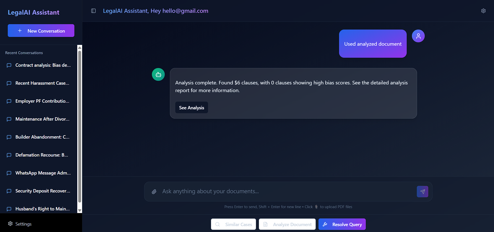
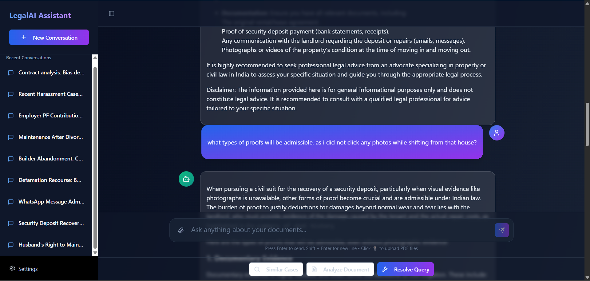
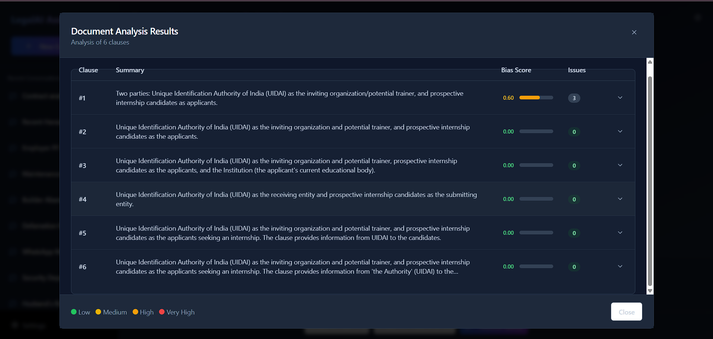
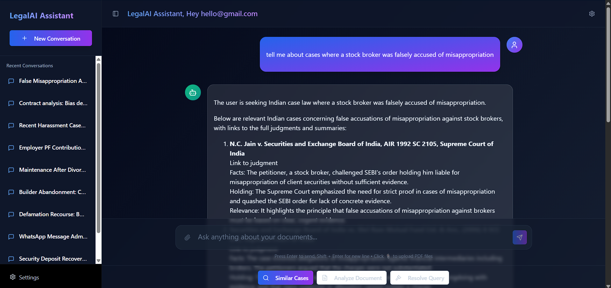

# KANUN-LegalAI

A modern, full-stack web application for secure, authenticated chat and Retrieval-Augmented Generation (RAG) workflows. Built with React, Vite, TypeScript, Redux, and Tailwind CSS, this project offers a robust, extensible platform for advanced query interfaces.

## Why This Project is Unique

- **Seamless RAG Integration**: Designed for next-generation AI applications, enabling retrieval-augmented generation directly in the chat interface.
- **Enterprise-Ready Security**: Implements protected routes and robust authentication, ensuring only authorized users access sensitive features.
- **Component-Driven UI**: Highly modular, with reusable UI components and hooks for rapid feature development.
- **Modern Developer Experience**: Fast builds and hot reloads with Vite, strict type safety with TypeScript, and easy state management via Redux.
- **Customizable & Scalable**: Easily adapt the interface, authentication, and chat logic for your own use case or product.

## Features

- 🔒 **Protected Routes**: Only authenticated users can access key pages, enforced via a custom `ProtectedRoute` component.
- 💬 **Chat Interface**: Real-time chat UI with message display, typing indicators, and file upload support.
- 🧠 **RAG Workflow**: Components and services designed for retrieval-augmented generation, ideal for AI-powered search and Q&A.
- 🎨 **Modern UI**: Built with Tailwind CSS and a library of reusable UI components for a beautiful, responsive experience.
- 🗂️ **State Management**: Redux-based user and chat state for predictable, scalable data flow.
- ⚡ **Fast & Easy Setup**: Powered by Vite for instant dev server start and lightning-fast builds.

## Project Structure

```
├── public/                # Static assets
│   ├── png-1.png
│   ├── png-2.png
│   ├── png-3.png
│   └── png-4.png
├── src/
│   ├── components/        # UI and app components
│   ├── hooks/             # Custom React hooks
│   ├── lib/               # Utility functions
│   ├── pages/             # Page components (Home, Login, Signup, etc.)
│   └── services/          # API and state management (Redux)
├── ...
```

## App Screenshots

<p align="center">
  
  
  
  
</p>

## Getting Started

### Prerequisites

- Node.js (v18+ recommended)
- Bun (if using bun.lockb)

### Installation

```sh
npm install
# or
bun install
```

### Running the App

```sh
npm run dev
# or
bun run dev
```

### Building for Production

```sh
npm run build
# or
bun run build
```

## License

MIT

---

_Generated by GitHub Copilot_
